<h3 align="center"> PX4二次开发-通信机制 </h3>

    <h4 style="background-color: #FFFF00; display: inline-block; padding: 5px;">PX4外部通信机制-Mavlink</h4>

#### 一、Mavlink协议

​	mavlink是PX4定义的一种消息传输协议，它的协议规定如下：主要用于PX4和板外设备，如地面站、机载电脑、传感器等之间的通信。

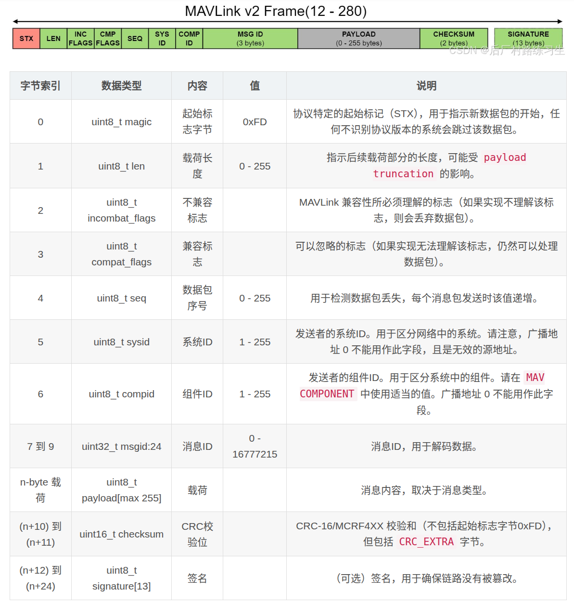

    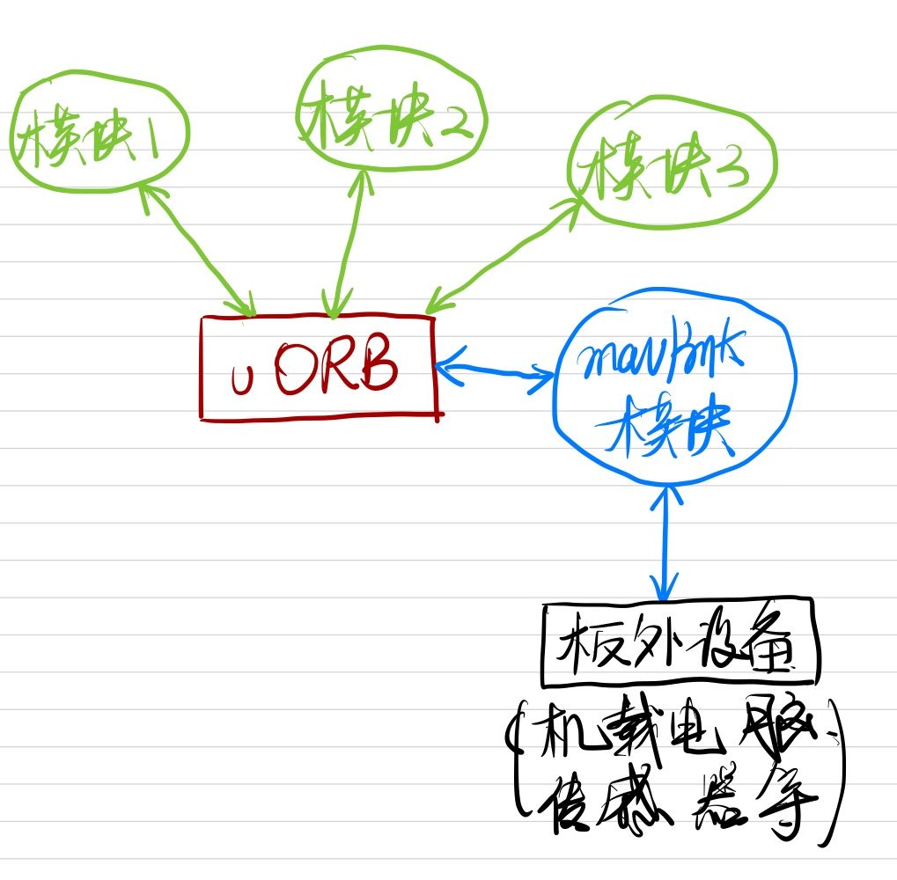

​	上图展示了PX4通信的基本机制，在PX4内部的不同模块之间，是通过uORB来进行相互通信的，而与板外设备之间，PX4定义了mavlink通信协议，可以通过串口或者UDP等进行通信。mavlink本身在PX4中也是以一个模块(APP)的形式存在的，它也可以像其他模块一样通过uORB在内部模块之间进行通信，然后通过mavlink协议可以将uORB消息转发到板外，或者接受到来自板外的mavlink消息之后，通过uORB把信息传递给程序中的其他模块。下图展示了一张更加详细的PX4板内外通信图：

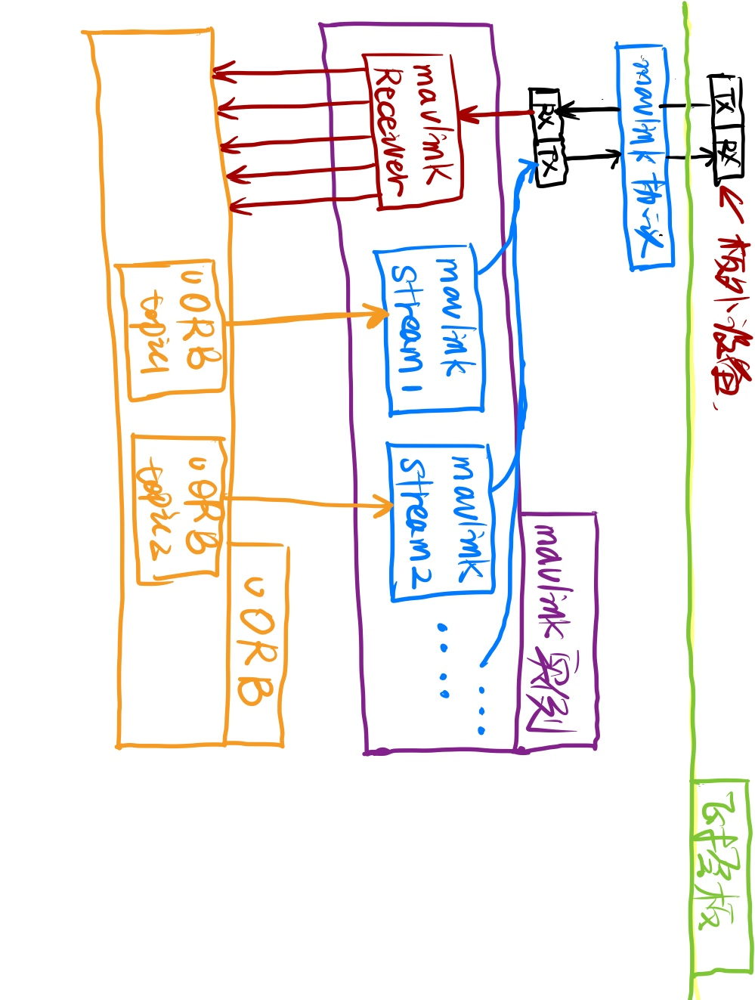

​	我们解释一下上面这张图，在PX4中，mavlink也是一个模块(就像我们上次写的hello_px4一样)运行在飞控板上。在PX4中，针对不同的串口设备或者UDP端口，我们可以启动多个不同的mavlink实例。每一个mavlink实例由一个`MavlinkReceiver`和若干个`MavlinkStream`组成。其中`MavlinkReceiver`负责从串口设备中接收数据，并将mavlink消息解析完成之后，将消息转换成uORB消息并通过uORB发布，以供内部程序使用；而`MavlinkStream`有多个实例，它负责将uORB消息转换成mavlink协议规定的格式，并通过串口发布出去。与`MavlinkReceiver`不同的是，每一个`MavlinkStream`通常只负责一个`uORB`话题消息的转发，因此每一个mavlink实例中通常会有多个`MavlinkStream`实例。

#### 二、具体实现

##### 1、串口初始化

​	我们通过阅读代码来看一下PX4中的mavlink是怎么实现的。

​	我们可以在`mavlink_main.cpp`中找到启动代码，并最终看到在启动过程中会有这样几句话：

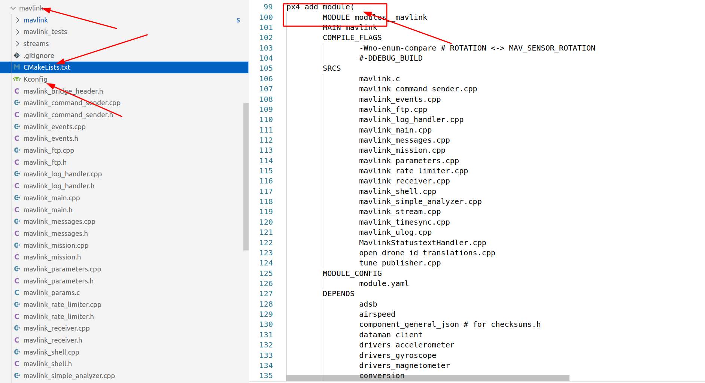

从上面可以看到，这里mavlink根据进行了串口初始化。

##### 2、**MavlinkReceiver的启动**

​	我们在`mavlink_main.cpp`中会看到这样一句代码：

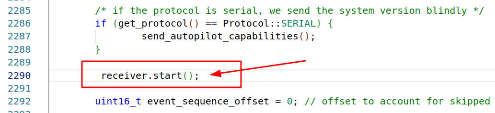

​	它的作用就是启动`MavlinkReciever`，我们跟进去看一下这个函数的实现：

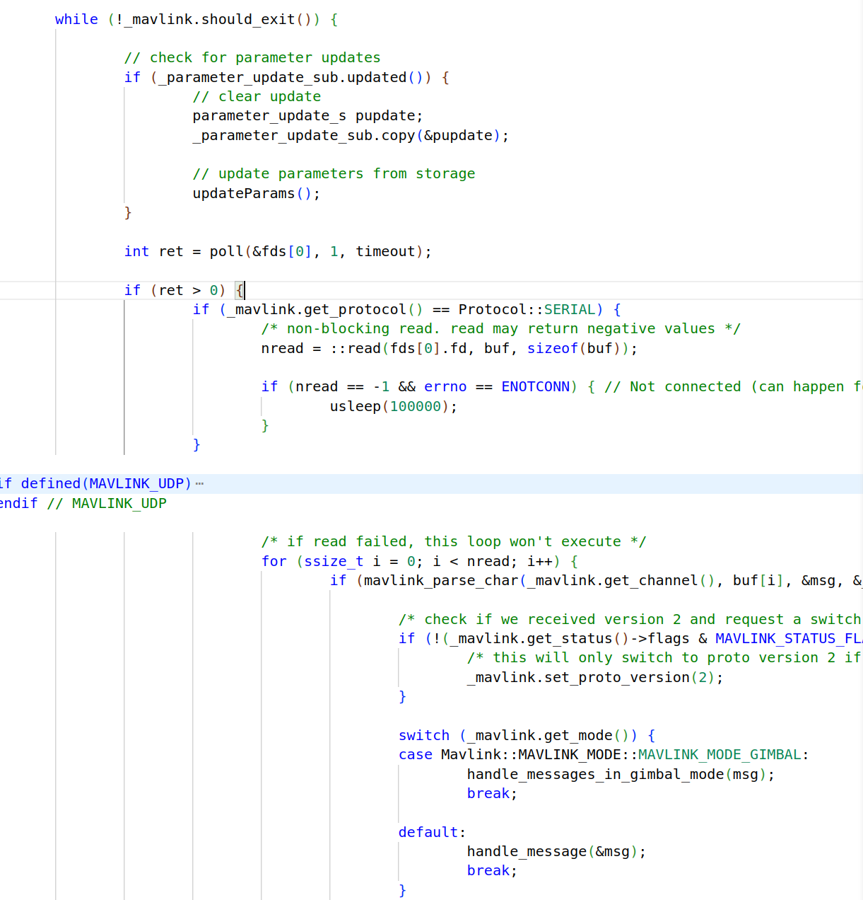

可以看到，它的函数主体是一个循环，在循环中不断读取并解析串口数据，如果解析到一个完整的数据包，则调用`handle_message`接口进行消息处理，我们再进去看一下`handle_message`接口的实现：

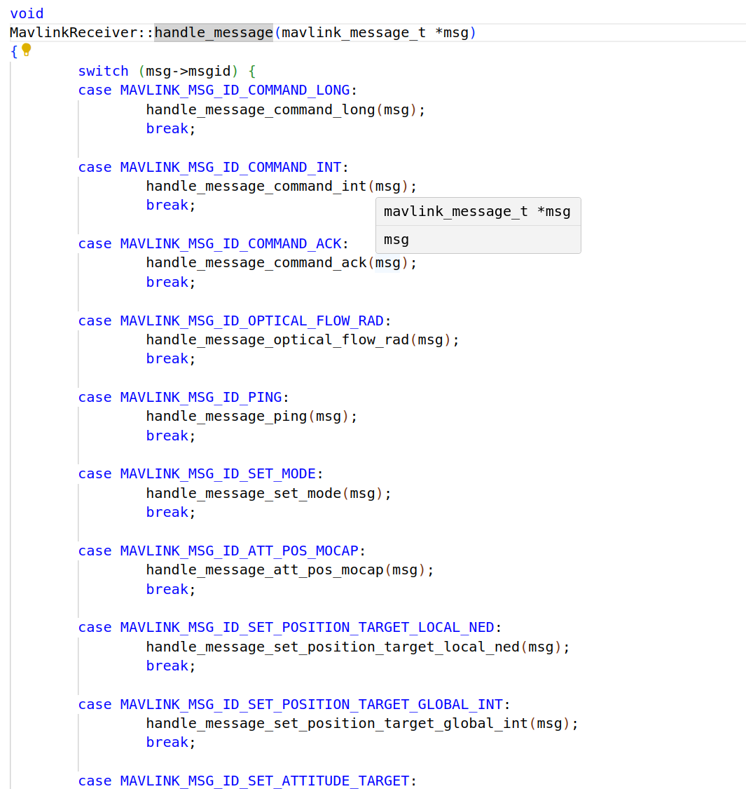

可以看到它是针对不同的messageid来调用不同的函数，我们以`optical_flow`为例来看一下这个函数的实现：

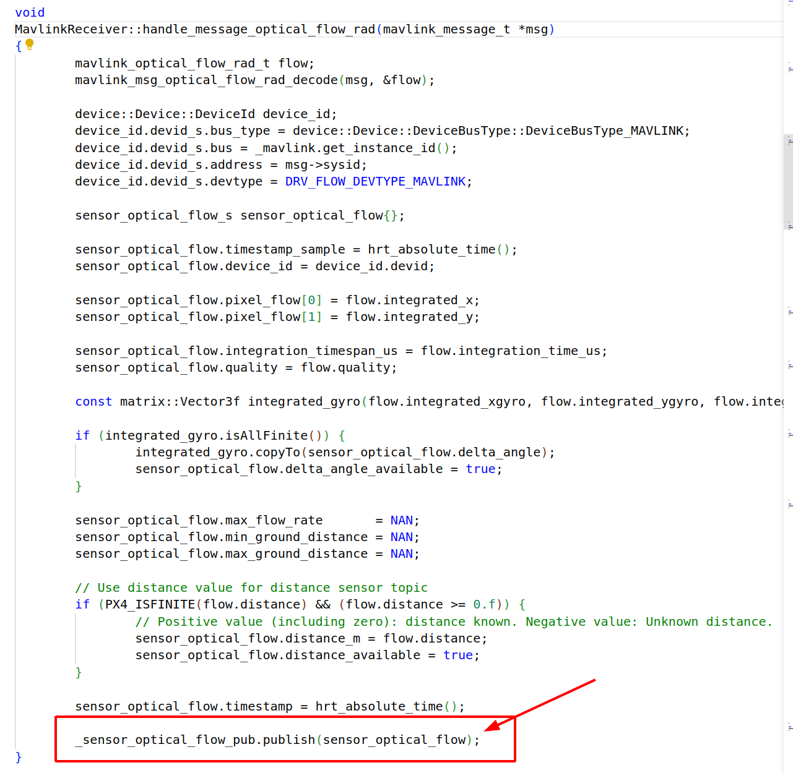

可以看到，它最终是将接收到的mavlink消息转换为uORB消息并发布出去，之后此消息即可被PX4的内部程序访问到并使用。

##### 3、****MavlinkStream****

继续往下看`mavlink_main.cpp`的代码，我们会看到下面一段话：

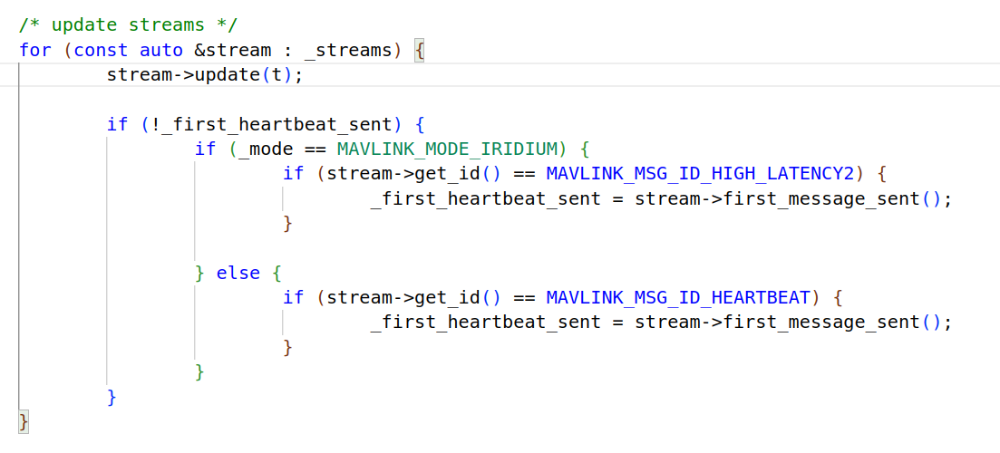

这里会遍历`Mavlink`的所有`MavlinkStream`对象，并调用它的`update`函数。这个函数的作用可以简单理解为将uORB消息转发为mavlink消息，这一点后面还会讲到。

##### 4、**MavlinkStream的初始化**

​	我们首先解决一个问题：在一个`Mavlink`实例中，`MavlinkStream`是何时被创建并初始化的？我们还是在代码中寻找，我们在代码中看到这样一句话：

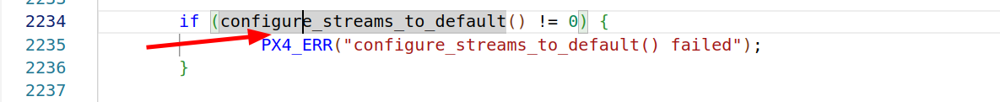

它调用了`config_streams_to_default`，听起来就像是进行`MavlinkStream`初始化的，我们再进去看一下这个函数的实现：

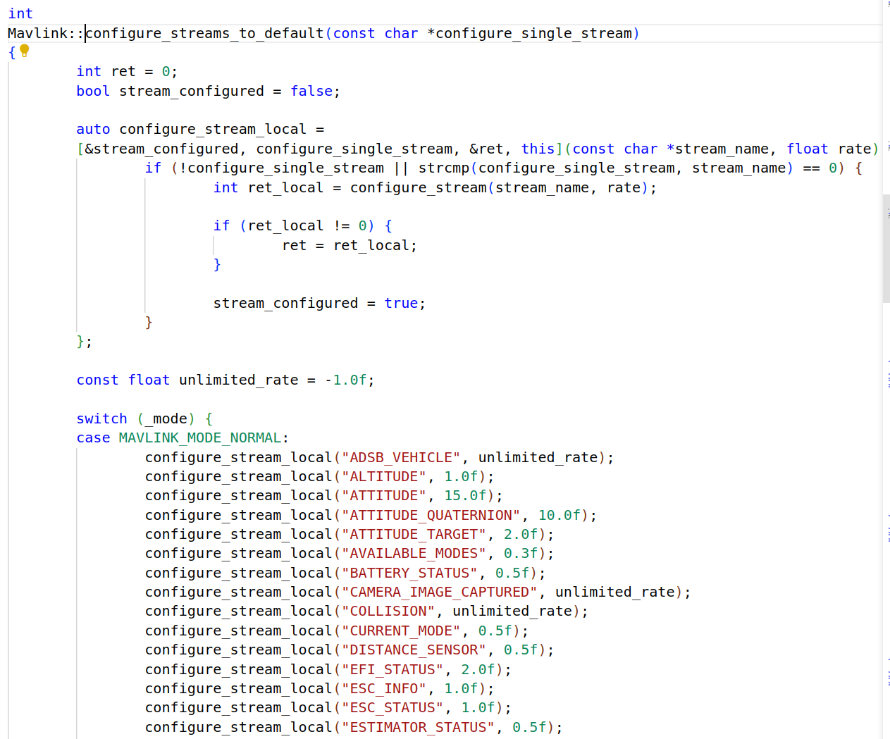

会发现，它的作用就是根据不同的mode来创建不同的stream。

##### 5、**MavlinkStream的update接口干了啥**

我们跟进去看一下，它最终是这样一段代码：

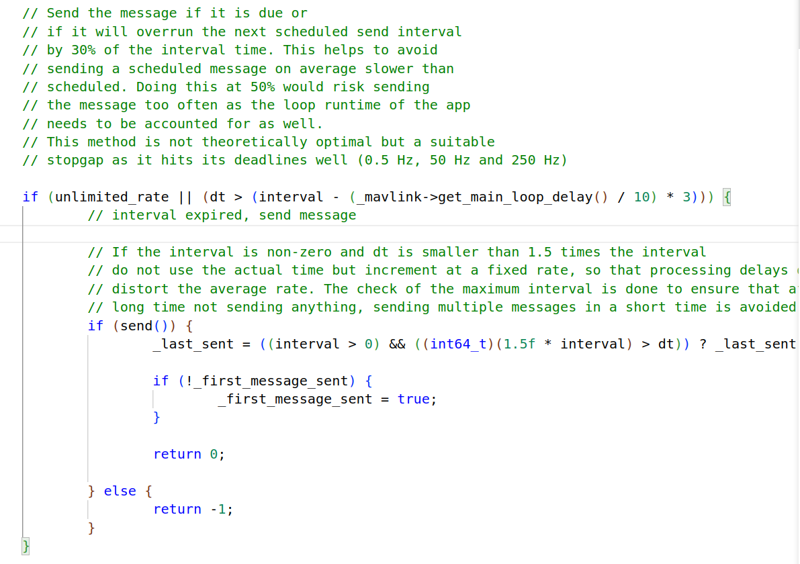

可以看到，这里在进行时间间隔判断之后，调用了`send`函数进行数据发送，我们以`ATTITUDE_QUATERNION`为例，看看`send`函数发生了什么：

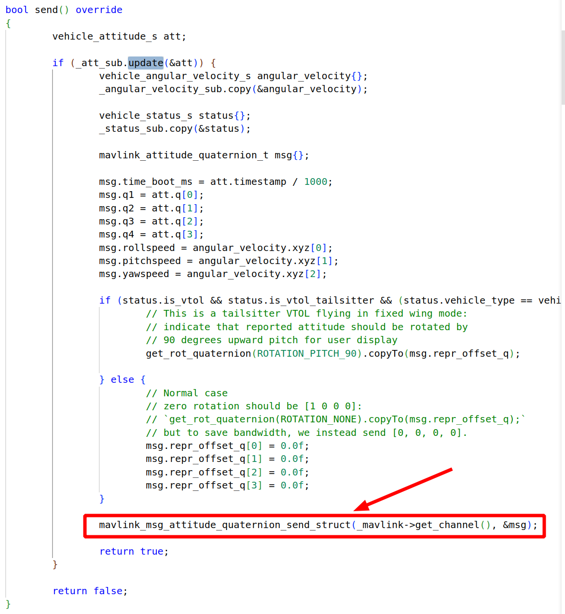

从上面可以看到，这里主要是做了一次uORB消息的转发，并最终通过mavlink发送出去。
