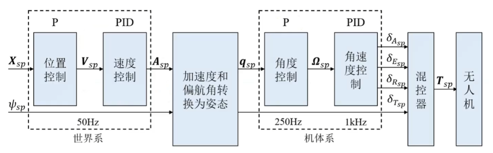
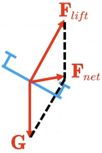
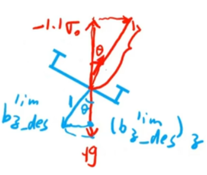

<h2 style="text-align: center">PX4飞控原理</h2>
###  1、系统框架

​	在PX4里，所定义的世界系为北东地(即NED，x轴指向北，y轴指向东，z轴指向地)

### **2、位置环**

#### 	**Ⅰ、位置控制**

​	在位置控制器中，只使用了P控制，根据下面公式1的计算，最终得到期望的速度。
$$
\mathbf{v}_{d}=\mathbf{v}_{df}+\mathbf{K}_{pd}(\mathbf{p}_d-\mathbf{p}) \\
\mathbf{v}_{d}^{\mathrm{lim}}=\lim(\mathbf{v}_d) 
\tag{$1$}
$$
其中，$$\mathbf{v}_{df}$$ 表示前馈速度，$$\mathbf{p}_d$$ 表示期望位置，$$\mathbf{K}_{pd}$$ 为位置比例增益，$$\mathbf{v}_{d}^{\mathrm{lim}}$$ 表示限幅后的速度。

#### 	**Ⅱ、速度控制**

​	在速度控制器中，使用PID控制，根据加速度前馈最终得到期望加速度。
$$
\mathbf{e}_{v}=\mathbf{v}_{d}^{lim}-\mathbf{v} \\
\mathbf{a}_{d}=\mathbf{a}_{df}+\mathbf{K}_{vp}\mathbf{e}_{v}+\mathbf{I}_{v}+\mathbf{K}_{vd}(0-\dot{\mathbf{v}})
\tag{$2$}
$$
​	其中，$$\mathbf{e}_{v}$$ 表示速度误差，$$\mathbf{a}_{df}$$ 表示前馈加速度，$$\mathbf{K}_{vp}$$ 表示速度比例增益，$$\mathbf{I}_{v}$$ 表示抗饱和积分，$$\mathbf{K}_{vd}$$ 表示微分增益。

​	==ps:== 下面解释微分项 $$\mathbf{K}_{vd}(0-\dot{\mathbf{v}})$$ 的得来。根据公式(2)我们求微分得到$$\dot{\mathbf{e}_{v}}=\dot{\mathbf{v}_{d}}^{lim}-\dot{\mathbf{v}}$$ ,工程上要求期望速度变化尽量小，因此将其置为0。

#### 	**Ⅲ、加速度求解姿态**

##### 	**（1）求解机体z轴方向**

​	第一步，根据上述由速度控制所求得的期望加速度$$\mathbf{a}_{d}$$ ,我们将其转化为姿态。其中，$$\mathbf{F}_{lift}$$ 为机体升力方向（垂直于机体平面），$$\mathbf{F}_{net}$$ 为合力方向。

$$
\begin{aligned}
&\mathbf{F}_{net}=\mathbf{F}_{lift}+\mathbf{G} \\
&
\mathbf{F}_{lift}=\mathbf{F}_{net}-\mathbf{G}
\end{aligned}
\tag{$3$}
$$

​	然后我们对公式(3)进行变形得到 $\mathbf{a}_{lift}=\frac{1}{m}\mathbf{F}_{net}-\frac{1}{m}\mathbf{G}=\mathbf{a}_{des}-\frac{1}{m}\mathbf{G}$ $= \begin{bmatrix} a_{des_x} \\ a_{des_y} \\ a_{des_z}-g \end{bmatrix}$ ，又由于无人机机体系的z轴正方向指向地，因此我们可以得到$\mathbf{b}_{z_{des}}=-\mathbf{a}_{lift}= \begin{bmatrix} -a_{des_x} \\ -a_{des_y} \\ -a_{des_z}+g \end{bmatrix}$ 。

##### 	（2）计算油门c

​	第二步，我们将上述得到的 $$\mathbf{b}_{z_{des}}$$ 归一化并限制倾角后得到期望的机体z轴方向 $$b_{z_{des}}^{lim}$$ 。根据下面的公式4我们可以计算得出油门标量(垂直于机体平面)。其中，$$\sigma_{0}$$ 表示悬停油门的大小(正值)，$$\sigma_{d}$$ 表示油门大小(为负值，意味着朝上)。
$$
\sigma_{d}=\frac{1}{(b_{z_{des}}^{lim})_{z}}\left[\frac{(a_{des})_{z}}{g}\sigma_{0}-\sigma_{0}\right]
\tag{$4$}
$$

##### 	（3）计算期望姿态

​	第三步，由于水平和垂直方向的油门裕度设置不同，我们需要进行油门的分配和限幅，由公式5得 到 $$\sigma_{d}$$ 。因此使得油门矢量得到更新，进而导致期望的机体系z轴方向更新得到 $$\mathbf{b}_{zd}$$ 。

$$
\sigma_{d}^{raw} = \sigma_{d} \mathbf{b}_{z_{des}}^{lim} \\
\sigma_{d} = thr_{allocation}(\sigma_{d}^{raw}) \\
\mathbf{b}_{zd} = \mathbf{b}_{z\_des}^{update} = \frac{-\sigma_{d}}{||\sigma_{d}||} 
\tag{$5$}
$$
​	完全的期望姿态我们是按Z-Y-X的欧拉角旋转顺序得到的，因此我们第一步先绕Z轴旋转偏航角 $$\psi_{d}$$ ,得到此时的 y 轴方向 $$\mathbf{y}_{yaw}$$ ，接着第二步绕Y轴旋转，此时得到 $$\mathbf{b}_{xd}$$ ,且可以发现其垂直于 $$\mathbf{y}_{yaw}$$ ，最后我们绕着X轴(即 $$\mathbf{b}_{xd}$$ )旋转，可以发现 $$\mathbf{b}_{xd}$$ 亦垂直于 $$\mathbf{b}_{zd}$$ ，因此我们可以通过叉乘得到 $$\mathbf{b}_{xd}$$ ,最终X、Z轴确定后，我们很容易通过叉乘得到 $$\mathbf{b}_{yd}$$ 。到此，我们计算得到了期望姿态 $$\mathbf{R}_d$$ ，后续可通过将该姿态矩阵转成四元数用于控制部分的计算，也可将其转成欧拉角便于记录。
$$
\mathbf{y}_{yaw} = [-\sin\psi_{d}, \cos\psi_{d}, 0]^{\text{T}} \\
\mathbf{b}_{xd} = \frac{\mathbf{y}_{yaw} \times \mathbf{b}_{zd}}{||\mathbf{y}_{yaw} \times \mathbf{b}_{zd}||} \\

\mathbf{b}_{yd} = \mathbf{b}_{zd} \times \mathbf{b}_{xd} \\
\mathbf{R}_d=[\mathbf{b}_{xd},\mathbf{b}_{yd},\mathbf{b}_{zd}]
\tag{$6$}
$$

### 3、姿态环

​	==ps:此处先介绍下四元数如何描述姿态与旋转。==

​	首先，四元数可表示为 $\mathbf{q}=q_0+q_1\mathbf{i}+q_2\mathbf{j}+q_3\mathbf{k}\quad(\mathbf{i}^2=\mathbf{j}^2=\mathbf{k}^2=\mathbf{i}\mathbf{j}\mathbf{k}=-1)$ ，记为$\mathbf{q}= \begin{bmatrix} q_0 & q_1 & q_2 & q_3 \end{bmatrix}^T\quad$ 或$\quad\mathbf{q}= \begin{bmatrix} s \\ \mathbf{v} \end{bmatrix}$ 。

​	若绕坐标系中的轴u旋转 $$\theta$$ 角，则该旋转运动对应的四元数为：$\mathbf{q}= \begin{bmatrix} \cos\frac{\theta}{2} \\ \\ \mathrm{usin}\frac{\theta}{2} \end{bmatrix}$ ，其中 $\|\mathbf{q}\|=\sqrt{q_0^2+q_1^2+q_2^2+q_3^2}=1,\|\mathbf{u}\|=1$ 。

​	四元数对三维空间中任一向量v的旋转作用可描述为：$\mathbf{q}\otimes \begin{bmatrix} 0 \\ \mathbf{v} \end{bmatrix}\otimes\mathbf{q}^*$ ，其中 $$\mathbf{q}^*$$ 表示为 $$\mathbf{q}$$ 的共轭，表示为$\quad\mathbf{q}^*= \begin{bmatrix} s \\ \mathbf{-v} \end{bmatrix}$ 。左乘四元数q等同于左乘矩阵 $L(\mathbf{q})= \begin{bmatrix} q_0 & -q_1 & -q_2 & -q_3 \\ q_1 & q_0 & -q_3 & q_2 \\ q_2 & q_3 & q_0 & -q_1 \\ q_3 & -q_2 & q_1 & q_0 \end{bmatrix}$ ，

右乘四元数q等同于左乘矩阵 $R(\mathbf{q})= \begin{bmatrix} q_0 & -q_1 & -q_2 & -q_3 \\ q_1 & q_0 & q_3 & -q_2 \\ q_2 & -q_3 & q_0 & q_1 \\ q_3 & q_2 & -q_1 & q_0 \end{bmatrix}$ 。因此我们可以得到 $\mathbf{q}\otimes \begin{bmatrix} 0 \\ \mathbf{v} \end{bmatrix}\otimes\mathbf{q}^*=L(\mathbf{q})R(\mathbf{q}^*) \begin{bmatrix} 0 \\ \mathbf{v} \end{bmatrix}$$= \begin{bmatrix} q_0 & -q_1 & -q_2 & -q_3 \\ q_1 & q_0 & -q_3 & q_2 \\ q_2 & q_3 & q_0 & -q_1 \\ q_3 & -q_2 & q_1 & q_0 \end{bmatrix} \begin{bmatrix} q_0 & q_1 & q_2 & q_3 \\ -q_1 & q_0 & -q_3 & q_2 \\ -q_2 & q_3 & q_0 & -q_1 \\ -q_3 & -q_2 & q_1 & q_0 \end{bmatrix} \begin{bmatrix} 0 \\ \mathbf{v} \end{bmatrix}$ 

$=\begin{bmatrix} 1 & 0 & 0 & 0 \\ 0 & q_{1}^{2}+q_{0}^{2}-q_{3}^{2}-q_{2}^{2} & q_{1}q_{2}-q_{0}q_{3}-q_{0}q_{3}+q_{1}q_{2} & q_{1}q_{3}+q_{0}q_{2}+q_{1}q_{3}+q_{0}q_{2} \\ 0 & q_{1}q_{2}+q_{0}q_{3}+q_{0}q_{3}+q_{1}q_{2} & q_{1}^{2}-q_{3}^{2}+q_{0}^{2}-q_{1}^{2} & q_{2}q_{3}+q_{2}q_{3}-q_{0}q_{1}-q_{0}q_{1} \\ 0 & q_{1}q_{3}-q_{0}q_{2}+q_{1}q_{3}-q_{0}q_{2} & q_{2}q_{3}+q_{2}q_{3}+q_{0}q_{1}+q_{0}q_{1} & q_{3}^{2}-q_{2}^{2}-q_{1}^{2}+q_{0}^{2} \end{bmatrix} \begin{bmatrix} 0 \\ v_{x} \\ v_{y} \\ v_{z} \end{bmatrix}$ 

 进一步化简并提取变换作用于v的部分可得：
$$
\left.\mathbf{v}^{\prime}=\left[ \begin{array} {ccc}q_0^2+q_1^2-q_2^2-q_3^2 & 2(q_1q_2-q_0q_3) & 2(q_1q_3+q_0q_2) \\ 2(q_1q_2+q_0q_3) & q_0^2-q_1^2+q_2^2-q_3^2 & 2(q_2q_3-q_0q_1) \\ 2(q_1q_3-q_0q_2) & 2(q_2q_3+q_0q_1) & q_0^2-q_1^2-q_2^2+q_3^2 \end{array}\right.\right]\mathbf{v}= \mathbf{R}\mathbf{v}
$$
​	机体系下的旋转复合：$\mathbf{q}=\mathbf{q}_z\mathbf{q}_y\mathbf{q}_x$ ,而对于世界系下：$\mathbf{q}=\mathbf{q}_x\mathbf{q}_y\mathbf{q}_z$ 。(此处的旋转顺序按Z-Y-X的欧拉角旋转顺序)

#### **Ⅰ：角度控制**

​	(1)倾转分离

​	根据上述得到的旋转变换矩阵，我们可以得到 ${\mathbf{b}_z}=\begin{bmatrix} 2(q_0q_2+q_1q_3) \\ 2(q_2q_3-q_0q_1) \\ q_0^2-q_1^2-q_2^2+q_3^2 \end{bmatrix}_q$ ，而我们的期望z轴为$\mathbf{b}_{zd}=\begin{bmatrix} 2(q_{0d}q_{2d}+q_{1d}q_{3d}) \\ 2(q_{2d}q_{3d}-q_{0d}q_{1d}) \\ q_{0d}^2-q_{1d}^2-q_{2d}^2+q_{3d}^2 \end{bmatrix}_{q_d}$ ，通过叉乘可以得到世界系下的旋转轴 $$\mathbf{k}$$ 以及旋转角度  $$\theta $$$\begin{cases} \mathbf{k}=\mathbf{b}_z\times\mathbf{b}_{zd} \\ \theta=\arccos(\mathbf{b}_z^T\mathbf{b}_{zd}) & \end{cases}$,记作 $\mathbf{q}_{e,red}= \begin{bmatrix} \cos\frac{\theta}{2} \\ \\ \mathbf{k}\mathrm{sin}\frac{\theta}{2} \end{bmatrix}$ 。由于上述的旋转轴 $$\mathbf{k}$$ 为世界系下的，我们需要将其转成机体系下的，因此通过基变换得到机体系下的该旋转变换为 ${\mathbf{q}^{-1}\otimes\mathbf{q}_{e,red}\otimes\mathbf{q}}$  ，最终可得到整个的倾斜姿态四元数为 $\mathbf{q}_{red}=\mathbf{q}\otimes(\mathbf{q}^{-1}\otimes\mathbf{q}_{e,red}\otimes\mathbf{q})=\mathbf{q}_{e,red}\otimes\mathbf{q}$ 。

​	接下来，计算偏航部分的四元数。首先，通过 ${\mathbf{q}}_{e,mix}=\mathbf{q}_{red}^{-1}\otimes\mathbf{q}_{full}$  将偏航角度从全姿态中提取出来，由于PX4对于偏航角度并不要求全部满足，只要求部分满足，即实际偏航角度小于理论计算的偏航角，因此通过下面的公式重新得到了新的倾转四元数 $$\mathbf{q}_{mix} = \mathbf{q}_{red} \otimes \begin{bmatrix} \cos[k \arccos(\mathbf{q}_{e,mix}[0])] \\ 0 \\ 0 \\ \sin[k \arcsin(\mathbf{q}_{e,mix}[0])] \end{bmatrix}$$ ，其中

$$k \in [0, 1]$$ 。

​	(2)计算期望角速度

​	根据上述得到的新的倾转四元数，再将初始姿态到当前姿态的四元数部分剔除，得到完全的倾转四元数$\mathbf{q}_e=\mathbf{q}^{-1}\otimes\mathbf{q}_{mix}$  ，最后提取其中的角度部分并做P控制，得到最后的期望角速度 $\omega_{d}=K_{p\Omega}*q_{e[1:3]}$ ，其中 $$K_{p\Omega}$$ 为角速度比例增益。

#### **Ⅱ：角速度控制**

​	在角速度环中，使用的是PID控制，根据下述公式7的计算得到期望力矩。
$$
\mathbf{e}_{\omega} = \omega_{d} - \omega \\
\boldsymbol{\tau}_{q} = \mathbf{K}_{p\omega} * \mathbf{e}_{\omega} + \mathbf{I}_{\omega} + \mathbf{K}_{dw}(0 - \dot{\omega}) + \mathbf{K}_{ff}\omega \\
\mathbf{I}_{\omega} = \int c\left(\mathbf{e}_{\omega}\right)\mathbf{K}_{l\omega}\mathbf{e}_{\omega}dt\\

c\left(\mathbf{e}_{\omega}\right) = \max\left[1 - \left(\frac{\mathbf{e}_{\omega}}{\mathbf{e}_{\omega,\max}}\right)^{2}, 0\right]
\tag{$7$}
$$
​	其中，$$\mathbf{K}_{p\omega}$$ 为角速度比例增益，$$\mathbf{I}_{\omega}$$ 为角速度误差的积分项，$$\mathbf{K}_{dw}(0 - \dot{\omega})$$ 为角速度误差的微分项，$$\mathbf{K}_{ff}\omega$$ 为角速度前馈，$$\mathbf{K}_{l\omega}$$ 为角速度积分增益。$$c\left(\mathbf{e}_{\omega}\right)$$ 的作用在于：当角速度误差很大时，积分项不参与作用，当误差逐渐减小时，积分项才慢慢起作用，这样能够防止大角度飞行时带来的姿态误差上的震荡。

### **3、混控器**

​	我们按照下图定义电机顺序，电机1、2为逆时针方向，3、4为顺时针。

$$
\tau_{x} = \frac{\sqrt{2}}{2} d c_{T} (-\omega_{1}^{2} + \omega_{2}^{2} + \omega_{3}^{2} - \omega_{4}^{2})\\
\tau_{y} = \frac{\sqrt{2}}{2} d c_{T} (\omega_{1}^{2} - \omega_{2}^{2} + \omega_{3}^{2} - \omega_{4}^{2})\\
\tau_{z} = c_{M} (\omega_{1}^{2} + \omega_{2}^{2} - \omega_{3}^{2} - \omega_{4}^{2})\\
f = c_{T} (\omega_{1}^{2} + \omega_{2}^{2} + \omega_{3}^{2} + \omega_{4}^{2})
\tag{$8$}
$$
​	根据上述公式8，我们可以得到力矩与电机转速的关系，其中d表示旋翼力臂长度，$$c_{T}$$ 表示升力系数，$$c_{M}$$ 表示反扭矩系数。

​	$$\omega_{1}、\omega_{2}、\omega_{3}、\omega_{4}$$ 前面正负号的判断：根据PX4坐标系的定义，大拇指沿着坐标轴，四指的方向即为产生升力的正方向。

​	最后，我们可以写成如下矩阵形式，如公式9：
$$
\begin{bmatrix} \tau_x \\ \tau_y \\ \tau_z \\ f_{_b} \end{bmatrix}= \begin{bmatrix} -\frac{\sqrt{2}}{2}dc_T & \frac{\sqrt{2}}{2}dc_T & \frac{\sqrt{2}}{2}dc_T & -\frac{\sqrt{2}}{2}dc_T \\ \frac{\sqrt{2}}{2}dc_T & -\frac{\sqrt{2}}{2}dc_T & \frac{\sqrt{2}}{2}dc_T & -\frac{\sqrt{2}}{2}dc_T \\ c_M & c_M & -c_M & -c_M \\ c_T & c_T & c_T & c_T \end{bmatrix} \begin{bmatrix} \omega_1^2 \\ \omega_2^2 \\ \omega_3^2 \\ \omega_4^2 \end{bmatrix}=A \omega^2
\tag{$9$}
$$

$$
\begin{bmatrix} \omega_{1}^{2} \\ \omega_{2}^{2} \\ \omega_{3}^{2} \\ \omega_{4}^{2} \end{bmatrix}= m\begin{bmatrix} -\frac{\sqrt{2}}{2}dc_{T} & \frac{\sqrt{2}}{2}dc_{T} & c_{M} & c_{T} \\ \frac{\sqrt{2}}{2}dc_{T} & -\frac{\sqrt{2}}{2}dc_{T} & c_{M} & c_{T} \\ \frac{\sqrt{2}}{2}dc_{T} & \frac{\sqrt{2}}{2}dc_{T} & -c_{M} & c_{T} \\ -\frac{\sqrt{2}}{2}dc_{T} & -\frac{\sqrt{2}}{2}dc_{T} & -c_{M} & c_{T} \end{bmatrix} \begin{bmatrix} \tau_{x} \\ \tau_{y} \\ \tau_{z} \\ f \end{bmatrix}
\tag{$10$}
$$

​	上述A矩阵我们也可以称为控制分配矩阵，对A阵求逆便可得到公式10中的形式。

​	在实际过程中，上述的 $$c_{T}$$ 、$$c_{M}$$ 等参数不易测量确定，因此我们对其进行过滤得到下面的表达式：$\begin{bmatrix} \sigma_1 \\ \sigma_2 \\ \sigma_3 \\ \sigma_4 \end{bmatrix}= \begin{bmatrix} -0.707 & 0.707 & 1 & 1 \\ 0.707 & -0.707 & 1 & 1 \\ 0.707 & 0.707 & -1 & 1 \\ -0.707 & -0.707 & -1 & 1 \end{bmatrix} \begin{bmatrix} \tau_{dx} \\ \tau_{dy} \\ \tau_{dz} \\ f \end{bmatrix}$ ，中间的矩阵称为混控矩阵，不同的机型对应不同的混控矩阵。由于过滤的计算导致上述的某些系数丢失，他们会对系统产生误差，因此我们需要调节前面控制器的参数以消除产生的误差影响。
