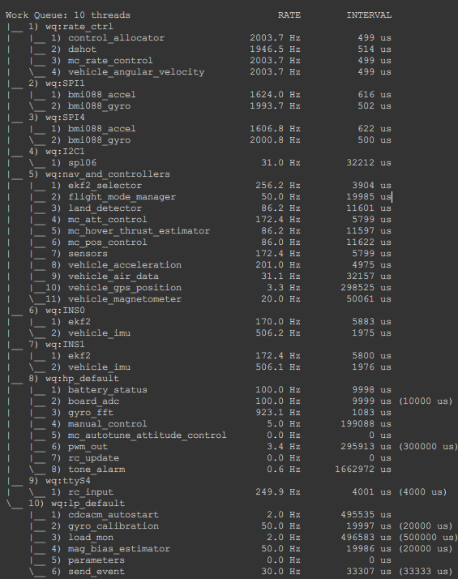
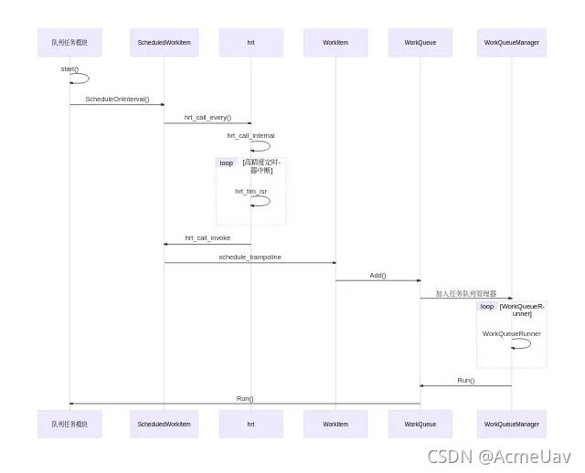

# PX4任务调度机制

[TOC]

## 前言

在px4中书写app的时候，对于一些简单的实例，我们可以通过直接运行example文件夹下面的cpp文件。然而，由于ntx系统实时操作性，我们会关注程序对于整体性能的影响。因此，PX4官网提供了两种不用的任务调度方式。

- **Tasks**: The module runs in its own task with its own stack and process priority.
- **Work queue tasks**: The module runs on a shared work queue, sharing the same stack and work queue thread priority as other modules on the queue.
  - All the tasks must behave co-operatively as they cannot interrupt each other.
  - Multiple *work queue tasks* can run on a queue, and there can be multiple queues.
  - A *work queue task* is scheduled by specifying a fixed time in the future, or via uORB topic update callback。

工作队列的优点是 RAM 占用更少，减少任务切换，缺点是队列任务不能休眠，也不能轮询消息。对于运行时间长的任务应该使用Tasks或者在一个独立的工作队列中。

首先我们要知道，PX4中基本的app任务都继承自3种不同的父类：

- ModuleBase：它提供了标准的 **命令行接口（CLI）**，使得用户可以通过 MAVLink Console 或终端输入 `module_name`。用户在终端有`start\stop\status`3种附加选项，用于启动，关闭以及显示app的状态。
- ModuleParams：提供了对 PX4 **参数系统**的访问能力，允许模块在运行时读取和更新飞控参数。
- px4::ScheduledWorkItem: 提供了任务调度能力，允许模块的逻辑（`Run()` 方法）在**工作队列（Work Queue）**中周期性或事件驱动地执行。

## Tasks(任务)

### 时序图


### 源码

px4官方提供了对应的模板：`\src\templates`下的`template_module.cpp`与`template_module.hpp`文件。首先我们来看头文件。

```c++
#pragma once

#include <px4_platform_common/module.h>
#include <px4_platform_common/module_params.h>
#include <uORB/SubscriptionInterval.hpp>
#include <uORB/topics/parameter_update.h>

using namespace time_literals;

extern "C" __EXPORT int template_module_main(int argc, char *argv[]);

// 这里可以看到，给出的实例模板继承了两个父类，其中ModuleBase父类带有参数<TemplateModule>
// 让父类可以调用子类中的函数。
class TemplateModule : public ModuleBase<TemplateModule>, public ModuleParams
{
public:
    //构造函数
	TemplateModule(int example_param, bool example_flag);
	//析构函数
	virtual ~TemplateModule() = default;

	/** @see ModuleBase */
	static int task_spawn(int argc, char *argv[]);

	/** @see ModuleBase */
	static TemplateModule *instantiate(int argc, char *argv[]);

	/*用于自定义命令行操作*/
	static int custom_command(int argc, char *argv[]);
	
	static int print_usage(const char *reason = nullptr);

	/*继承自modulebase父类的run()函数，用于复写用户自定义的函数*/
	void run() override;

	/*用于中断status选项打印状态*/
	int print_status() override;

private:

	/**
	 * Check for parameter changes and update them if needed.
	 * @param parameter_update_sub uorb subscription to parameter_update
	 * @param force for a parameter update	 */
	void parameters_update(bool force = false);


	DEFINE_PARAMETERS(
		(ParamInt<px4::params::SYS_AUTOSTART>) _param_sys_autostart,   /**< example parameter */
		(ParamInt<px4::params::SYS_AUTOCONFIG>) _param_sys_autoconfig  /**< another parameter */
	)

	// Subscriptions
	uORB::SubscriptionInterval _parameter_update_sub{ORB_ID(parameter_update), 1_s};

};
```

接着是c文件。

```c++
#include "template_module.h"

#include <px4_platform_common/getopt.h>
#include <px4_platform_common/log.h>
#include <px4_platform_common/posix.h>

#include <uORB/topics/parameter_update.h>
#include <uORB/topics/sensor_combined.h>

// 用于使用命令行参数 status的时候，打印消息。
int TemplateModule::print_status()
{
	PX4_INFO("Running");
	// TODO: print additional runtime information about the state of the module

	return 0;
}
// 自定义命令
int TemplateModule::custom_command(int argc, char *argv[])
{
	/*
	if (!is_running()) {
		print_usage("not running");
		return 1;
	}

	// additional custom commands can be handled like this:
	if (!strcmp(argv[0], "do-something")) {
		get_instance()->do_something();
		return 0;
	}
	 */

	return ("unknown command");
}

// 这个函数是task任务调度的起点
int TemplateModule::task_spawn(int argc, char *argv[])
{
	_task_id = px4_task_spawn_cmd("module",//模块名称
				      SCHED_DEFAULT,       //调度方式
				      SCHED_PRIORITY_DEFAULT,//优先级
				      1024,				   //分配栈空间
				      (px4_main_t)&run_trampoline,//函数入口
				      (char *const *)argv);

	if (_task_id < 0) {
		_task_id = -1;
		return -errno;
	}

	return 0;
}

//实例化函数
TemplateModule *TemplateModule::instantiate(int argc, char *argv[])
{
	int example_param = 0;
	bool example_flag = false;
	bool error_flag = false;

	int myoptind = 1;
	int ch;
	const char *myoptarg = nullptr;

	// parse CLI arguments
	while ((ch = px4_getopt(argc, argv, "p:f", &myoptind, &myoptarg)) != EOF) {
		switch (ch) {
		case 'p':
			example_param = (int)strtol(myoptarg, nullptr, 10);
			break;

		case 'f':
			example_flag = true;
			break;

		case '?':
			error_flag = true;
			break;

		default:
			PX4_WARN("unrecognized flag");
			error_flag = true;
			break;
		}
	}

	if (error_flag) {
		return nullptr;
	}

	TemplateModule *instance = new TemplateModule(example_param, example_flag);

	if (instance == nullptr) {
		PX4_ERR("alloc failed");
	}
	
	return instance;
}

// 构造函数
TemplateModule::TemplateModule(int example_param, bool example_flag)
	: ModuleParams(nullptr)
{
}

// 这个函数是用户代码放置的地方
void TemplateModule::run()
{
	// Example: run the loop synchronized to the sensor_combined topic publication
	int sensor_combined_sub = orb_subscribe(ORB_ID(sensor_combined));

	px4_pollfd_struct_t fds[1];
	fds[0].fd = sensor_combined_sub;
	fds[0].events = POLLIN;

	// initialize parameters
	parameters_update(true);

	while (!should_exit()) {

		// wait for up to 1000ms for data
		int pret = px4_poll(fds, (sizeof(fds) / sizeof(fds[0])), 1000);

		if (pret == 0) {
			// Timeout: let the loop run anyway, don't do `continue` here

		} else if (pret < 0) {
			// this is undesirable but not much we can do
			PX4_ERR("poll error %d, %d", pret, errno);
			px4_usleep(50000);
			continue;

		} else if (fds[0].revents & POLLIN) {

			struct sensor_combined_s sensor_combined;
			orb_copy(ORB_ID(sensor_combined), sensor_combined_sub, &sensor_combined);
			// TODO: do something with the data...

		}

		parameters_update();
	}

	orb_unsubscribe(sensor_combined_sub);
}

// 参数更新，这个方法继承自ModuleParam类，后续可以看一下
void TemplateModule::parameters_update(bool force)
{
	// check for parameter updates
	if (_parameter_update_sub.updated() || force) {
		// clear update
		parameter_update_s update;
		_parameter_update_sub.copy(&update);

		// update parameters from storage
		updateParams();
	}
}


int TemplateModule::print_usage(const char *reason)
{
	if (reason) {
		PX4_WARN("%s\n", reason);
	}

	PRINT_MODULE_DESCRIPTION(
		R"DESCR_STR(
### Description
Section that describes the provided module functionality.

This is a template for a module running as a task in the background with start/stop/status functionality.

### Implementation
Section describing the high-level implementation of this module.

### Examples
CLI usage example:
$ module start -f -p 42

)DESCR_STR");

	PRINT_MODULE_USAGE_NAME("module", "template");
	PRINT_MODULE_USAGE_COMMAND("start");
	PRINT_MODULE_USAGE_PARAM_FLAG('f', "Optional example flag", true);
	PRINT_MODULE_USAGE_PARAM_INT('p', 0, 0, 1000, "Optional example parameter", true);
	PRINT_MODULE_USAGE_DEFAULT_COMMANDS();

	return 0;
}

//主函数，是static function, 不需要TemplateModule类的实例化，就可以运行。
int template_module_main(int argc, char *argv[])
{
	return TemplateModule::main(argc, argv);
}

```

### 任务调度流程

接着，我们从命令行敲入`template_module start`开始，解释整个 **Task**的程序调度过程。

其实如果在命令行输入模块名称`template_module`,  并且回车，程序就会自动调用`TemplateModule`父类`ModuleBase()`中的 `int main(int argc, char * argv[])`

```c++
static int main(int argc, char *argv[])
	{
		if (argc <= 1 ||
		    strcmp(argv[1], "-h")    == 0 ||
		    strcmp(argv[1], "help")  == 0 ||
		    strcmp(argv[1], "info")  == 0 ||
		    strcmp(argv[1], "usage") == 0) {
			return T::print_usage(); //打印用法
		}

		if (strcmp(argv[1], "start") == 0) {
			return start_command_base(argc - 1, argv + 1); // 启动task
		}

		if (strcmp(argv[1], "status") == 0) {
			return status_command(); // 调用打印参数的函数
		}

		if (strcmp(argv[1], "stop") == 0) {
			return stop_command();  //终止task
		}
    	
		lock_module(); 
		int ret = T::custom_command(argc - 1, argv + 1);
		unlock_module();

		return ret;
	}
```

其实在这里，对于上面说的3个参数的执行原理就非常清楚了。在之前，我一直对cpp文件中的`custom_command()`函数十分不解，不知道这个函数在哪里调用，在这里，其实已经写的很清楚了，`T::custom_command(argc - 1, argv + 1)`会调用子类的自定义命令函数，但是在终端的输入必须不是，

`start,status,stop`三种命令中的任何一种。

```cpp
if (strcmp(argv[1], "start") == 0) {
	 return start_command_base(argc - 1, argv + 1); // 启动task
}
```

我们看看`start_command_base`函数：

```c++
static int start_command_base(int argc, char *argv[])
{
    int ret = 0;
    lock_module();

    if (is_running()) {
        ret = -1;
        PX4_ERR("Task already running");

    } else {
        ret = T::task_spawn(argc, argv);

        if (ret < 0) {
            PX4_ERR("Task start failed (%i)", ret);
        }
    }

    unlock_module();
    return ret;
}

```

可以看到，这里调用了子类的 `task_spawn` 方法，我们看到了熟悉的`px4_task_spawn_cmd`,这个函数单独开启了一个线程，并且可以自定义参数。

```cpp
// 这个函数是task任务调度的起点
int TemplateModule::task_spawn(int argc, char *argv[])
{
	_task_id = px4_task_spawn_cmd("module",//模块名称
				      SCHED_DEFAULT,       //调度方式
				      SCHED_PRIORITY_DEFAULT,//优先级
				      1024,				   //分配栈空间
				      (px4_main_t)&run_trampoline,//函数入口
				      (char *const *)argv);

	if (_task_id < 0) {
		_task_id = -1;
		return -errno;
	}

	return 0;
}
```

接着通过函数指针`run_trampoline`，再次进入父类方法。我这里给出PX4，`module`中的`trampoline`函数：

```c++
	/**
	 * @brief Entry point for px4_task_spawn_cmd() if the module runs in its own thread.
	 *        It does:
	 *        - instantiate the object
	 *        - call run() on it to execute the main loop
	 *        - cleanup: delete the object
	 * @param argc The task argument count.
	 * @param argc Pointer to the task argument variable array.
	 * @return Returns 0 iff successful, -1 otherwise.
	 */

	static int run_trampoline(int argc, char *argv[])
	{
		int ret = 0;

		// We don't need the task name at this point.
		argc -= 1;
		argv += 1;

		T *object = T::instantiate(argc, argv); //调用子类的instantiate方法，会在heap上完成实例化
		_object.store(object);					

		if (object) {
			object->run();     //开始运行run()函数

		} else {
			PX4_ERR("failed to instantiate object");
			ret = -1;
		}

		exit_and_cleanup();

		return ret;
	}

```

`_object`变量在 `module.h`中存在定义，是一个专门用于存储子类指针的原子变量，可以实现类的单例。

```c++
template<class T>
px4::atomic<T *> ModuleBase<T>::_object{nullptr};
```

最终，程序还是进入到最重要的`run()`函数，这个函数中我们可以将我们想要执行的代码放进去，同时遵循一定的格式，由于 `task`系统会为其开辟一个新的线程，所以可以直接使用while循环，下面是模板中一个非常经典的写法。注意，`while(!should_exit)`是必须的，这提供了在控制台 `module stop`终止线程的方法。

```c++
void TemplateModule::run()
{
	// Example: run the loop synchronized to the sensor_combined topic publication
	int sensor_combined_sub = orb_subscribe(ORB_ID(sensor_combined));

	px4_pollfd_struct_t fds[1];
	fds[0].fd = sensor_combined_sub;
	fds[0].events = POLLIN;

	// initialize parameters
	parameters_update(true);

	while (!should_exit()) {

		// wait for up to 1000ms for data
		int pret = px4_poll(fds, (sizeof(fds) / sizeof(fds[0])), 1000);

		if (pret == 0) {
			// Timeout: let the loop run anyway, don't do `continue` here

		} else if (pret < 0) {
			// this is undesirable but not much we can do
			PX4_ERR("poll error %d, %d", pret, errno);
			px4_usleep(50000);
			continue;

		} else if (fds[0].revents & POLLIN) {

			struct sensor_combined_s sensor_combined;
			orb_copy(ORB_ID(sensor_combined), sensor_combined_sub, &sensor_combined);
			// TODO: do something with the data...

		}

		parameters_update();
	}

	orb_unsubscribe(sensor_combined_sub);
}

```

这里，有一个**问题**，既然在 `task`中，我们的任务放在了 `run()`函数中的`while`中，那么为什么不直接在cpp中书写一个 `while`呢，显而易见这有几个不可取的地方，首先是缺少推出循环的方式，`should_exit`函数被写在了`moduleBase`中，我们必须要继承后方能使用。其次，我通过执行以下代码发现，直接执行`while`会导致控制台的阻塞，而且无法通过`px4_usleep`让出CPU时间片。(待解决)

```c++
#include <stdio.h>
#include <px4_platform_common/log.h>

extern "C" __EXPORT int my_test_main(int argc, char* argv[]) {

 printf("Hello PX4!\n");
 while(1) {
     px4_usleep(1000000); // Sleep for 1 second
 }
 return 0;

}

```

最后回头看看这张时序图，其中的机理其实已经不难理解了。我认为可以高度概括以上流程。


### 小节补充

- 首先是`custom_command`函数，这个函数允许我们自己编写命令。

```c++
int TemplateModule::custom_command(int argc, char *argv[])
{
	/*
	if (!is_running()) {
		print_usage("not running");
		return 1;
	}

	// additional custom commands can be handled like this:
	//这里给出自定义命令的方式
	if (!strcmp(argv[0], "do-something")) {
		get_instance()->do_something();
		return 0;
	}
	 */

	return ("unknown command");
}
```

- 其次是C++中的 **奇异递归模板模式**，我们从时序图以及上述讲解中看到，父类子类之间会发生相互的调用， 这种设计看起来反直觉或“奇异”。通常，派生类继承基类，但在 CRTP 中，派生类在定义自身的同时，又被作为参数传递给基类。

  基本结构：

  ```c++
  template <class Derived>
  class Base {
      // ...
  };
  
  class MyDerived : public Base<MyDerived> {
      // ...
  };
  ```

## Work queue tasks（工作队列任务）

工作队列任务是PX4最为常见的一种任务调度方式，我们先在 `nsh` 控制台输入 `work queue stauts`, 看看PX4中的工作队列是什么样子的。工作队列从上到下，代表着其各个队列的优先级，越往上的优先级越高。每一个队列都是一个单独的线程。每一个队列（线程）中有若干`workItem`, 他们会顺序被执行。 而每个线程都有自身的优先级，举个例子，`wq:rate_ctrl`是优先级最高的线程。



`WorkItem`中有一个专门由于管理工作队列的线程：`workQueueManager`,`WorkQueueManagerRun()` 是工作队列的工厂与启动循环：它阻塞等“创建请求”，按 `wq_config_t` 创建对应 `wq` 线程（实时优先级、栈、策略），线程入口统一为 `WorkQueueRunner`，后者再驱动 `WorkQueue::Run()` 调用每个 `WorkItem::Run()`。

### 时序图



### 源码

还是先看`hpp`文件。

```c++
#include <px4_platform_common/defines.h>
#include <px4_platform_common/module.h>
#include <px4_platform_common/module_params.h>
#include <px4_platform_common/posix.h>
#include <px4_platform_common/px4_work_queue/ScheduledWorkItem.hpp>

#include <drivers/drv_hrt.h>
#include <lib/perf/perf_counter.h>

#include <uORB/Publication.hpp>
#include <uORB/Subscription.hpp>
#include <uORB/SubscriptionCallback.hpp>
#include <uORB/topics/orb_test.h>
#include <uORB/topics/parameter_update.h>
#include <uORB/topics/sensor_accel.h>
#include <uORB/topics/vehicle_status.h>

using namespace time_literals;

//此处继承了三个父类，多出了ScheduleWorkItem，这个父类用于添加到工作队列
class WorkItemExample : public ModuleBase<WorkItemExample>, public ModuleParams, public px4::ScheduledWorkItem
{
public:
	WorkItemExample();
	~WorkItemExample() override;

	/** @see ModuleBase */
	static int task_spawn(int argc, char *argv[]);

	/** @see ModuleBase */
	static int custom_command(int argc, char *argv[]);

	/** @see ModuleBase */
	static int print_usage(const char *reason = nullptr);

	bool init();

	int print_status() override;

private:
	void Run() override;

	// Publications
	uORB::Publication<orb_test_s> _orb_test_pub{ORB_ID(orb_test)};

	// Subscriptions
    // subscription that schedules WorkItemExample when updated
	uORB::SubscriptionCallbackWorkItem _sensor_accel_sub{this, ORB_ID(sensor_accel)};        
    // subscription limited to 1 Hz updates
	uORB::SubscriptionInterval         _parameter_update_sub{ORB_ID(parameter_update), 1_s}; 
    // regular subscription for additional data
	uORB::Subscription                 _vehicle_status_sub{ORB_ID(vehicle_status)};          
    
	// Performance (perf) counters
	perf_counter_t	_loop_perf{perf_alloc(PC_ELAPSED, MODULE_NAME": cycle")};
	perf_counter_t	_loop_interval_perf{perf_alloc(PC_INTERVAL, MODULE_NAME": interval")};

	// Parameters
	DEFINE_PARAMETERS(
		(ParamInt<px4::params::SYS_AUTOSTART>) _param_sys_autostart,   /**< example parameter */
		(ParamInt<px4::params::SYS_AUTOCONFIG>) _param_sys_autoconfig  /**< another parameter */
	)

	bool _armed{false};
};
```

### 任务调度流程

和 `task`任务一样，`WorkQueue`也继承了`ModuleBase`父类，所以启动流程非常相似。

```c++
extern "C" __EXPORT int work_item_example_main(int argc, char *argv[])
{
	return WorkItemExample::main(argc, argv);
}
```

进入`ModuleBase`父类的：

```c++
	static int main(int argc, char *argv[])
	{
		if (argc <= 1 ||
		    strcmp(argv[1], "-h")    == 0 ||
		    strcmp(argv[1], "help")  == 0 ||
		    strcmp(argv[1], "info")  == 0 ||
		    strcmp(argv[1], "usage") == 0) {
			return T::print_usage();
		}

		if (strcmp(argv[1], "start") == 0) {
			// Pass the 'start' argument too, because later on px4_getopt() will ignore the first argument.
			return start_command_base(argc - 1, argv + 1);
		}

		if (strcmp(argv[1], "status") == 0) {
			return status_command();
		}

		if (strcmp(argv[1], "stop") == 0) {
			return stop_command();
		}

		lock_module(); // Lock here, as the method could access _object.
		int ret = T::custom_command(argc - 1, argv + 1);
		unlock_module();

		return ret;
	}
```

```c++
	static int start_command_base(int argc, char *argv[])
	{
		int ret = 0;
		lock_module();

		if (is_running()) {
			ret = -1;
			PX4_ERR("Task already running");

		} else {
			ret = T::task_spawn(argc, argv);

			if (ret < 0) {
				PX4_ERR("Task start failed (%i)", ret);
			}
		}
		
		unlock_module();
		return ret;
	}
```

会到子类中，这次的`task_spwan`会有一点点不一样：

```c++
int WorkItemExample::task_spawn(int argc, char *argv[])
{
    //实例化workItemExample,指针寄存到_object
	WorkItemExample *instance = new WorkItemExample();

	if (instance) {
		_object.store(instance);
		_task_id = task_id_is_work_queue;
	//调用类中的init()函数
		if (instance->init()) {
			return PX4_OK;
		}

	} else {
		PX4_ERR("alloc failed");
	}

	delete instance;
	_object.store(nullptr);
	_task_id = -1;

	return PX4_ERROR;
}
```

`init()`函数中有着最重要的一部分代码，用户可以选择触发`Run()`函数的触发方式，可以是消息回调，也可以定时触发。

```c++
bool WorkItemExample::init()
{
	// execute Run() on every sensor_accel publication
	 if (!_sensor_accel_sub.registerCallback()) {
	 	PX4_ERR("callback registration failed");
	 	return false;
	 }

	// alternatively, Run on fixed interval
    ScheduleOnInterval(5000_us); // 2000 us interval, 200 Hz rate
	PX4_INFO("callback registration succeeded");
    
	return true;
}
```

接下来我们只需要在`Run()`函数中，进行订阅发布的操作就可以了。

